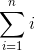

title: Python for everyone
avatar: http://www.gravatar.com/avatar/7cf19173e360b0e328de258ea52c1f9a
twitter: @NamPNQ
plus: +NamPNQ

---

title: Nội dung
class: googleblue

- Cơ bản về python
- Làm một trang web bé tẹo

---

title: Cơ bản về python 

Cài đặt python, pip

---

title: Cơ bản về python

Hãy quên tất cả những gì ta biết về lập trình 

(Dành cho những bạn đã biết hoặc biết tí tẹo)

---

title: Cơ bản về python

Học lập trình từ toán học

Toán học 

<pre>
f(x) = x + 1
</pre>

f -> gọi là hàm 

x -> gọi là biến 

---

title: Cơ bản về python 

Python

<pre class="prettyprint" data-lang="python">
f = lambda x : x + 1
</pre>

f -> gọi là hàm 

x -> gọi là biến 

=> Rất đơn giản và gần gũi 

---

title: Cơ bản về python 

Định nghĩa 1 hàm 

Ngoài cách như trên,

<pre class="prettyprint" data-lang="python">
def f(x):
    return x + 1
</pre>

---

title: Cơ bản về python 

Toán học 

---

title: Cơ bản về python

Python 

<pre class="prettyprint" data-lang="python">
total = 0
for i in range(0, n+1):
    total += i
</pre>

---

title: Cơ bản về python 

Python, viết ngắn gọn 

<pre class="prettyprint" data-lang="python">
sum([i for i in range(0, n+1)])
</pre>

---

title: Cơ bản về python 

Python, viết ngắn gọn nữa 

<pre class="prettyprint" data-lang="python">
sum(range(0, n+1))
</pre>

---

title: Cơ bản về python

Python, if, else 

<pre class="prettyprint" data-lang="python">
if troi_mua:
    chung_ta_nghi()
else:
    chung_ta_di_hoc()
</pre>

---

title: Cơ bản về python

Python, if. elif, else 

<pre class="prettyprint" data-lang="python">
if tien_me_cho > 10:
    mua_oshi()
elif tien_me_cho > 7:
    mua_kem()
else:
    mua_keo()
</pre>

---

title: Cơ bản về python 

Python, các loại giá trị của biến:

- 1, 2, 3, 10.5, 9e10 .. -> Kiểu số 
- "heo", "cho", "meo", "0123" .. -> Kiểu chữ 
- Đúng (True), Sai(False) -> Kiểu bool
- ...

---

title: Làm một trang web bé tẹo

Flask is Fun

---

title: Làm một trang web bé tẹo

<pre class="prettyprint" data-lang="sh">
$ pip install flask 
</pre>

---

title: Làm một trang web bé tẹo

Hello world 

<pre class="prettyprint" data-lang="python">
from flask import Flask
app = Flask(__name__)

@app.route("/")
def hello():
    return "Hello World!"

if __name__ == "__main__":
    app.run()
</pre>

<pre class="prettyprint" data-lang="sh">
$ python hello.py 
</pre>

---

title: Làm một trang web bé tẹo

---

title: Những thứ bạn cần học thêm

Python: 

- Python philosophy. python -c "import this"
- Decorator 
- Class
- Package 
- Unittest
- ...

Làm web:

- Web framework -> Backend 
- HTML/CSS/JS -> Frontend
- ...

---

title: Hỏi & Đáp 

---

title: Cảm ơn các bạn!
